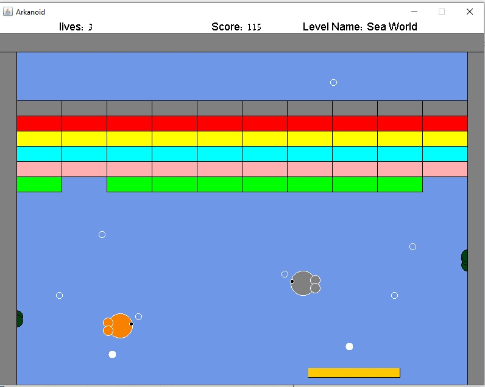

# Arkanoid-Game

This game was build with Java using OOP and observer design pattern. 

## How to run  
make sure you have java installed.  
then simply press the arkanoid.jar file and enjoy!  

## How to play

This game has 4 unique levels.  
When starting the game press 's' to start or 'h' to see your personal highscore.  
While playing you can press 'p' to pause and then 'space' to resume.  
Try to hit the blocks with the balls to collect points and avoid dropping the balls.  
Each time all the balls drop from the screen a life is reduced, after 3 times the game is over.  

##

